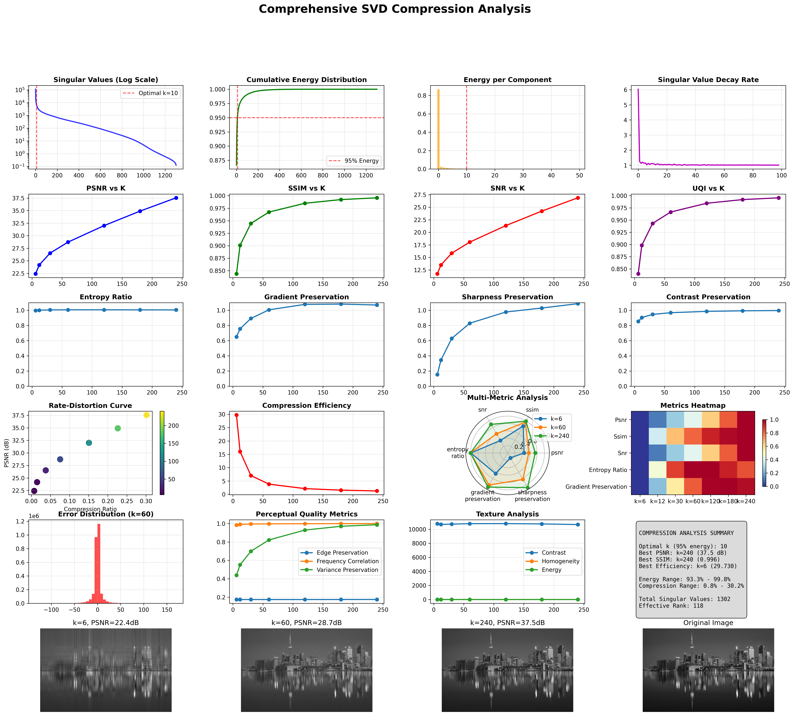
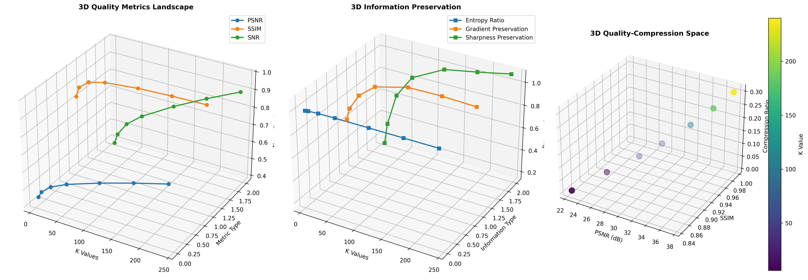
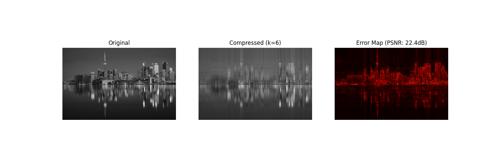
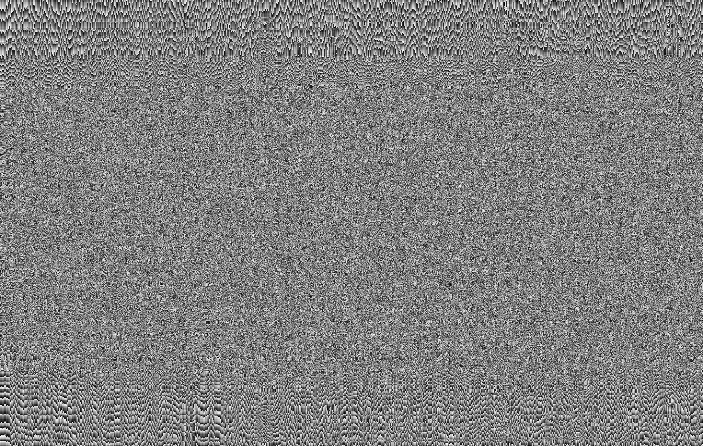
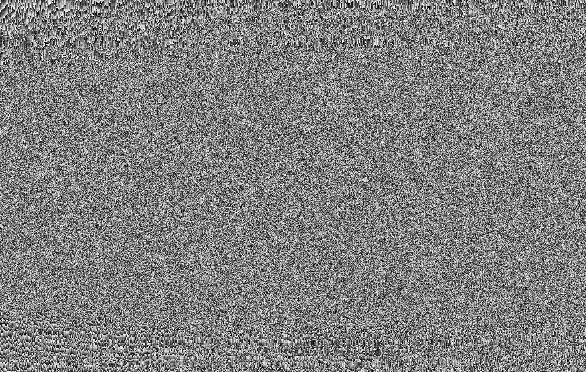

# SVD Image Compressor 🎯

An **ultra-advanced** Python tool for image compression using Singular Value Decomposition (SVD) with comprehensive analysis, visualization, and 20+ quality metrics.



## ✨ Features

### 🔬 Advanced Compression Analysis
- **20+ Quality Metrics**: PSNR, SSIM, SNR, UQI, entropy ratio, gradient preservation, texture analysis, and more
- **Adaptive Compression**: Automatic k-value selection based on image complexity
- **ROI-Aware Compression**: Region of Interest detection for optimized compression
- **Multi-dimensional Analysis**: 3D visualizations of quality-compression relationships

### 📊 Rich Visualizations
- **Comprehensive Analysis Plots**: 24-panel analysis with quality metrics, information theory, and perceptual metrics
- **3D Analysis**: Interactive 3D plots showing quality landscapes and compression spaces
- **Animated Compression**: GIF animations showing compression progression
- **Rate-Distortion Curves**: Optimization analysis for compression efficiency



### 🎬 Animation Support
Watch your compression in action with animated visualizations:



### 🖼️ Visual Results
Compare compression results across different k-values:

| Low Compression (k=6) | High Compression (k=240) |
|:---:|:---:|
|  |  |

## 🚀 How SVD Compression Works

Singular Value Decomposition factorizes an image matrix **A** into three matrices:
```
A = U × Σ × V^T
```

By keeping only the largest `k` singular values, we can reconstruct the image with:
- **Reduced storage**: From `m×n` to `k×(m+n+1)` values
- **Controlled quality**: Higher `k` = better quality, larger size
- **Energy preservation**: Captures most important image features

The tool performs:
1. **Image Loading**: URL, local file, or sample images
2. **SVD Decomposition**: Matrix factorization using optimized algorithms
3. **Reconstruction**: Image rebuilding with varying k-values
4. **Quality Analysis**: Comprehensive metric calculation
5. **Visualization**: Advanced plots and animations

## 📋 Requirements

### Core Dependencies
```bash
pip install numpy requests pillow matplotlib scipy
```

### Optional (Enhanced Features)
```bash
# For advanced metrics and ML features
pip install scikit-image scikit-learn opencv-python tqdm

# For GPU acceleration (optional)
pip install cupy  # NVIDIA GPU support
```

**Feature Availability:**
- ✅ **Core SVD Compression**: Always available
- 🔬 **Advanced Metrics**: Requires `scikit-image`
- 🤖 **ML Features**: Requires `scikit-learn`
- ⚡ **GPU Acceleration**: Requires `cupy`
- 📊 **Enhanced Visualizations**: Requires all optional packages

## 🎮 Usage

### Quick Start
```bash
python SVDCompresser.py
```

### Interactive Menu
The tool provides an interactive interface:

```
🖼️  Choose image source:
1. From URL
2. From local file
3. Use sample image

⚙️  Compression settings:
1. Quick test (simple k values)
2. Standard analysis
3. Extensive analysis
4. Custom k values

🔧 Advanced options:
- Adaptive compression
- ROI analysis
- Animation creation
- GPU acceleration
```

### Sample Images
Choose from 10 built-in sample images:
- Landscapes, portraits, nature scenes
- Architecture, food, animals
- Abstract art, sports, technology

## 📈 Analysis Outputs

### 1. Compression Results
- **Compressed Images**: Multiple k-values saved as PNG/JPEG
- **JSON Results**: Complete metrics data for further analysis
- **File Structure**:
  ```
  output/
  ├── compressed/
  │   ├── compressed_k12_20250711_204615.png
  │   ├── compressed_k120_20250711_204615.png
  │   └── ...
  ├── plots/
  │   ├── analysis_comprehensive.png
  │   └── analysis_3d.png
  ├── animations/
  │   └── compression_animation.gif
  └── results_20250711_204615.json
  ```

### 2. Quality Metrics

The tool calculates comprehensive quality metrics:

| Metric Category | Metrics |
|:---|:---|
| **Basic Quality** | MSE, MAE, RMSE, PSNR |
| **Structural** | SSIM, UQI, Spectral Angle |
| **Information Theory** | Entropy Ratio, SNR |
| **Perceptual** | Edge/Gradient/Sharpness Preservation |
| **Texture Analysis** | Contrast, Homogeneity, Energy |
| **Compression** | Ratio, Efficiency, Energy Preserved |

### 3. Advanced Analysis

#### Rate-Distortion Analysis
Find optimal compression points balancing quality vs. file size.

#### 3D Quality Landscapes
Visualize how different metrics interact across compression levels.

#### Adaptive K-Selection
Automatically choose optimal k-values based on:
- Image complexity (entropy, gradients)
- Content analysis (ROI detection)
- Quality requirements

## 🔧 Configuration

Create custom compression configurations:

```python
from SVDCompresser import CompressionConfig, SVDImageCompressor

config = CompressionConfig(
    energy_threshold=0.95,          # 95% energy preservation
    max_image_size=(2048, 2048),    # Maximum dimensions
    adaptive_compression=True,       # Smart k-value selection
    roi_analysis=True,              # Region of interest detection
    create_animations=True,         # Generate GIF animations
    use_gpu=True                    # GPU acceleration
)

compressor = SVDImageCompressor("output", config)
```

## 📊 Results Interpretation

### Optimal K-Value Selection
- **Energy Threshold**: Typically 95% captures most visual information
- **PSNR > 30dB**: Generally considered high quality
- **SSIM > 0.9**: Excellent structural similarity
- **Compression Ratio**: Lower = more compression

### Quality-Size Trade-offs
- **k=5-10**: High compression, noticeable quality loss
- **k=50-100**: Balanced compression and quality
- **k=200+**: Minimal compression, near-original quality

## 🔗 Related Projects

- [Image Quality Assessment](https://github.com/topics/image-quality)
- [SVD Applications](https://github.com/topics/singular-value-decomposition)
- [Compression Algorithms](https://github.com/topics/image-compression)

---
